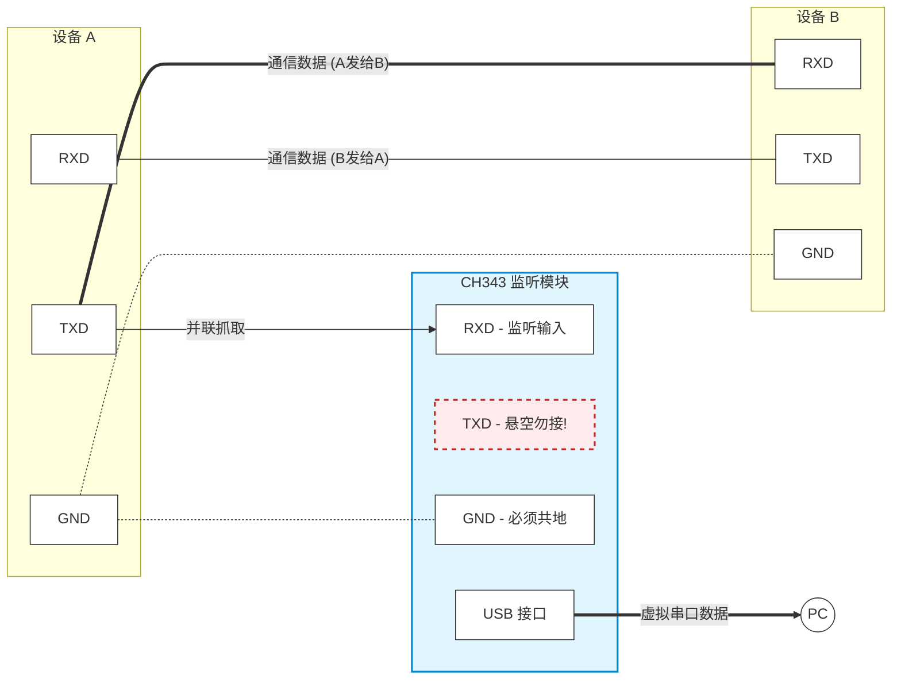

## 1. 原理

在串行通信（Serial Communication）中，引脚定义如下：

| 引脚                 | 定义                 |
| ------------------- | -------------------- |
| TXD (Transmit Data) | 数据的**输入**通道    |
| RXD (Receive Data)  | 数据的**输出**通道    |
| GND (Ground)        | 电路的公共电平参考基准 |

### 1.1 TXD (Transmit Data)

定义：数据的输出通道。它代表设备的“嘴巴”。

工作原理：当设备需要向外发送信息时，内部的 UART 控制器会将并行数据转换为串行数据，然后通过 TXD 引脚，按照设定的波特率，将数据一位一位地转化为高低电平发送出去。

物理状态：在标准的 TTL 电平下（1.8V / 3.3V / 5V），TXD 在没有数据发送的空闲状态下，始终保持高电平。当需要发送数据时，它会先拉低一个周期（起始位），然后开始发送数据位。

### 1.2 RXD (Receive Data)

定义：数据的输入通道。它代表设备的“耳朵”。

工作原理：设备通过 RXD 引脚实时监听外部线路上的电平变化。当它检测到电平从高突然变低，即捕捉到了起始位，就会按照约定好的波特率，开始读取后续的电平高低，并将其重新组合成完整的数据字节。

容错机制：RXD 只负责“听”。如果线路受到干扰，或者波特率设置与发送方不一致，RXD 依然会忠实地把读到的错误电平组合起来，这就导致了我们在串口工具中经常看到的“乱码”。

### 1.3 GND (Ground)

定义：电路的公共电平参考基准。

核心作用（极其重要）：这是整个通信的绝对基石。电压本身是一个“相对值”（电位差），就像高度一样。设备 A 发送了一个 3.3V 的高电平（代表数字 1），它是相对于设备 A 自己的 GND 而言是 3.3V。

如果没有连 GND：如果设备 B 的 GND 没有和设备 A 的 GND 连在一起，设备 A 发出的 3.3V，在设备 B 看来可能变成了 1V，也可能是 5V。此时设备 B 的 RXD 就无法正确判断收到的是 0 还是 1，导致通信彻底失败或全是乱码。因此，共地（连接两者的 GND）是任何有线电平通信的前提。

## 2. 操作步骤

这里我使用的是 CH343 串口模块，步骤如下：

1. 共地：CH343 的 GND 必须与设备 A/B 的 GND 连接；

2. 监听发送（A -> B）：将 CH343 的 RXD 接到设备 A 的 TXD，这根线同时也连着设备 B 的 RXD，能看到 A 发送给 B 的所有数据；

3. 监听接收（B -> A）：将 CH343 的 RXD 接到设备 A 的 RXD，这根线同时也连着设备 B 的 TXD，能看到 B 回复给 A 的所有数据；


注意：CH343 的 TXD 悬空：切记不要把 CH343 的 TXD 接到任何地方;

原因：如果在监听过程中 CH343 意外发送了数据，会造成信号冲突（短路），干扰原有通信甚至损坏端口;


### 2.1 示意图

下图为监听设备 A 发送给设备 B 的所有数据，如果需要监听设备 B 发送给设备 A 的所有数据，将 CH343 模块的 RXD 接到设备 B 的 TXD 即可。

